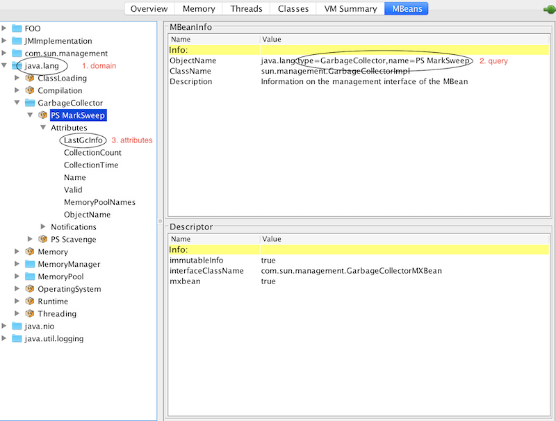

# Collecting JMX metrics from a JBoss eap 7.2 service running in Standalone-mode with https enabled

## Prerequisites

##  1. <a name='InstalltheInfrastructureagent'></a>Install the Infrastructure agent and JMX integration

- [Install Infrastructure for Linux using the package manager](https://docs.newrelic.com/docs/infrastructure/install-configure-manage-infrastructure/linux-installation/install-infrastructure-linux-using-package-manager)

  or 

- [Install Infrastructure for Windows Server using the MSI installer](https://docs.newrelic.com/docs/infrastructure/install-configure-manage-infrastructure/windows-installation/install-infrastructure-windows-server-using-msi-installer)

- [Install New Relic JMX integration](https://docs.newrelic.com/docs/integrations/host-integrations/host-integrations-list/jmx-monitoring-integration#install)

## 2. Expose JMX on https from JBoss

For this tutorial we will run a JBoss eap 7.2 service in Standalone-mode inside Docker. The configuration used can be checked
in config/standalone.xml. Build and run the docker image using the provided Dockerfile from the current directory.

Build and run the image, exposing the https JMX port 9993:
```bash
docker build -t test/jmx_jboss . && docker run -d -p 9993:9993 -p 8080:8080 -p 8443:8443 -p 9990:9990 test/jmx_jboss
```

### Install JBoss Custom connector
JMX allows the use of custom connectors to communicate with the application. In order to use a custom connector, you have to place the files inside the sub-folder connectors where nrjmx is installed.

For this example I'll copy the connectors from the newly created docker container:

```bash
sudo docker cp <container_id>:/home/jboss/jboss-eap-7.2/bin/client/. /usr/lib/nrjmx/connectors/
```

Test the JMX connection:

```bash
echo "*:*" | nrjmx -C service:jmx:remote+https://0.0.0.0:9993 -username admin -password Admin.123 -keyStore $(pwd)/key/jboss.keystore -keyStorePassword password -trustStore $(pwd)/key/jboss.truststore -trustStorePassword password
```

##  3. Configure JMX integration


### 3.1 First step is creating a JMX integration configuration file `/etc/newrelic-infra/integrations.d/jmx-config.yml`

```yaml
integration_name: com.newrelic.jmx

instances:
  - name: jmx
    command: all_data
    arguments:
      connection_url: "service:jmx:remote+https://localhost:9993"
      jmx_user: admin
      jmx_pass: Admin.123
      key_store: <tutorial_path>/key/jboss.keystore
      key_store_password: password
      trust_store: <tutorial_path>/key/jboss.truststore
      trust_store_password: password
      collection_files: "/etc/newrelic-infra/integrations.d/jmx-custom-metrics.yml"
    labels:
      env: staging
```

All configuration options can be found in the public [documentation](https://docs.newrelic.com/docs/integrations/host-integrations/host-integrations-list/jmx-monitoring-integration#config).

### 3.2 Creating the metric collection configuration file.
In the JMX configuration file, we specified a collection file `jmx-custom-metrics.yml`. This file is used to define which metrics we want to collect.

We can inspect the available JMX metrics using nrjmx command directly or a visual tool like  JConsole.


nrjmx tool ouputs the jmx metrics in JSON format. We can use jq tool to format the output to be more readable:

```bash
echo "*:*" | nrjmx -C service:jmx:remote+https://0.0.0.0:9993 -username admin -password Admin.123 -keyStore $(pwd)/key/jboss.keystore -keyStorePassword password -trustStore $(pwd)/key/jboss.truststore -trustStorePassword password
```

```bash
....
  "jboss.threads:name=default,type=thread-pool,attr=QueueSize": 0,
  "jboss.as:subsystem=infinispan,cache-container=hibernate,local-cache=timestamps,memory=object,attr=size": -1,
  "jboss.as:subsystem=datasources,data-source=ExampleDS,statistics=jdbc,attr=PreparedStatementCacheAddCount": 0,
  "java.lang:type=Compilation,attr=TotalCompilationTime": 33183,
....
```

If for example we want to capture the QueueSize attribute for multiple thread names, we can use the wildcard:

```yaml
collect:
  - domain: jboss.threads
    event_type: AnyNameSample
    beans:
      - query: name=*,type=thread-pool
        attributes:
          - QueueSize
```

The following example illustrates how to create a collection file using information provided by the JConsole Java tool:



```yaml
collect:
  - domain: java.lang
    event_type: AnyNameSample
    beans:
      - query: type=GarbageCollector,name=PS MarkSweep
        attributes:
          - LastGcInfo
```

### 3.3 Checking data

Save the changes in the yaml files, and [restart](https://docs.newrelic.com/docs/infrastructure/install-infrastructure-agent/manage-your-agent/start-stop-restart-infrastructure-agent) the agent. After a few minutes, go to New Relic and run the following [NRQL query](https://docs.newrelic.com/docs/query-data/nrql-new-relic-query-language):

```sql 
FROM AnyNameSample SELECT *
```


