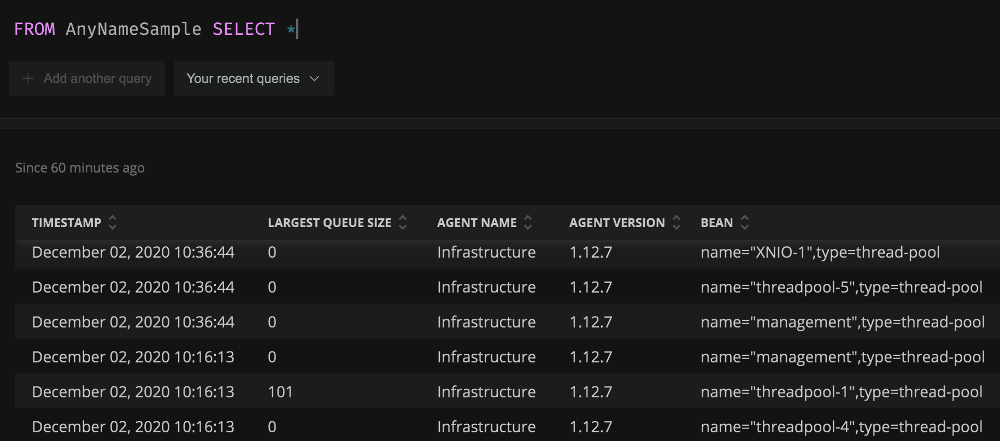

# Collecting JMX metrics from a JBoss service running in Standalone-mode

## Prerequisites

##  1. <a name='InstalltheInfrastructureagent'></a>Install the Infrastructure agent and JMX integration

- [Install Infrastructure for Linux using the package manager](https://docs.newrelic.com/docs/infrastructure/install-configure-manage-infrastructure/linux-installation/install-infrastructure-linux-using-package-manager)

  or 

- [Install Infrastructure for Windows Server using the MSI installer](https://docs.newrelic.com/docs/infrastructure/install-configure-manage-infrastructure/windows-installation/install-infrastructure-windows-server-using-msi-installer)

- [Install New Relic JMX integration](https://docs.newrelic.com/docs/integrations/host-integrations/host-integrations-list/jmx-monitoring-integration#install)

## 2. Expose JMX from JBoss

For this tutorial we will run a JBoss service in Standalone-mode inside Docker using the following Dockerfile:

```bash
FROM jboss/wildfly:18.0.0.Final

RUN /opt/jboss/wildfly/bin/add-user.sh admin1234 Password1! --silent

CMD ["/opt/jboss/wildfly/bin/standalone.sh", "-b", "0.0.0.0", "-bmanagement", "0.0.0.0"]
```

Build and run the image, exposing the JMX port 9990:

```bash	
docker build -t test_jboss . && docker run -d -p 9990:9990 test_jboss
```
### Install JBoss Custom connector
JMX allows the use of custom connectors to communicate with the application. In order to use a custom connector, you have to place the files inside the sub-folder connectors where nrjmx is installed.

For this example I'll copy the connectors from the newly created docker container:

```bash
sudo docker cp <container_id>:/opt/jboss/wildfly/bin/client/ /usr/lib/nrjmx/connectors/
```

##  3. Configure JMX integration


### 3.1 First step is creating a JMX integration configuration file `/etc/newrelic-infra/integrations.d/jmx-config.yml`

```yaml
integration_name: com.newrelic.jmx

instances:
  - name: jmx
    command: all_data
    arguments:
      jmx_host: 0.0.0.0
      jmx_port: 9990
      jmx_user: admin1234
      jmx_pass: Password1!
      jmx_remote: true
      jmx_remote_jboss_standlone: true
      collection_files : "/etc/newrelic-infra/integrations.d/jmx-custom-metrics.yml"
    labels:
      env: staging
```

All configuration options can be found in the public [documentation](https://docs.newrelic.com/docs/integrations/host-integrations/host-integrations-list/jmx-monitoring-integration#config).

### Test the JMX connection:

`nri-jmx` `query` tool uses the defined jmx-config.yml file to establish connection and  outputs the available JMX metrics.

```bash
/var/db/newrelic-infra/newrelic-integrations/bin/nri-jmx -query "*:*"
```

### 3.2 Creating the metric collection configuration file.
In the JMX configuration file, we specified a collection file `jmx-custom-metrics.yml`. This file is used to define which metrics we want to collect.

We can inspect the available JMX metrics using nri-jmx command directly or a visual tool like JConsole.

```bash
/var/db/newrelic-infra/newrelic-integrations/bin/nri-jmx -query "*:*"
```
```bash
....
=======================================================
  - domain: jboss.threads
    beans:
....
-------------------------------------------------------
      - query: name="threadpool-5",type=thread-pool
        attributes:
          # Value[DOUBLE]: 0
          - GrowthResistance
          # Value[INT]: 2147483647
          - MaximumQueueSize
....
```
If for example we want to create a collection file to capture the MaximumQueueSize attribute we can define:

`/etc/newrelic-infra/integrations.d/jmx-custom-metrics.yml`
```yaml
collect:
  - domain: jboss.threads
    event_type: AnyNameSample
    beans:
      - query: name=*,type=thread-pool
        attributes:
          - MaximumQueueSize
```
Notice the usage of `*` wildcard. This is useful when we want to capture all the metrics with that pattern.

The following example illustrates how to create a collection file using information provided by the JConsole Java tool:


```yaml
collect:
  - domain: java.lang
    event_type: AnyNameSample
    beans:
      - query: type=GarbageCollector,name=PS MarkSweep
        attributes:
          - LastGcInfo
```

### 3.3 Checking data

Save the changes in the yaml files, and [restart](https://docs.newrelic.com/docs/infrastructure/install-infrastructure-agent/manage-your-agent/start-stop-restart-infrastructure-agent) the agent. After a few minutes, go to New Relic and run the following [NRQL query](https://docs.newrelic.com/docs/query-data/nrql-new-relic-query-language):

```sql 
FROM AnyNameSample SELECT *
```




